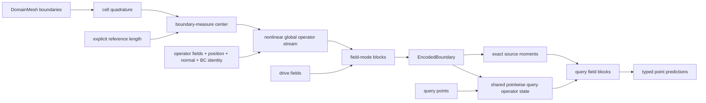

# Mesh Attention: an Exact Global Signed Moment Operator

Mesh attention is a reusable global, quadrature-aware,
O(\(D\))-equivariant primitive for boundary-driven models. It encodes the
boundaries of a
[`DomainMesh`](../../../mesh/domain_mesh.py), propagates physical driving
fields through a separate field stream, and evaluates predictions at arbitrary
query points. It is not, by itself, a general PDE solver.

The central layer is a **finite-rank separable signed integral operator**. Its
production path evaluates exact source moments in
\(O(N_{source}+N_{query})\) work per layer for fixed channel and rank sizes. It
does not materialize an all-pairs attention matrix. A dense
`forward_reference` evaluates the identical operator in
\(O(N_{source}N_{query})\) work and exists only as a correctness and gradient
oracle.

There is no softmax, graph neighborhood, distance cutoff, near/far truncation,
or spatial tree in the operator.

## 1. PDE motivation and scope

Many elliptic and approximately elliptic problems are strongly driven by their
boundary data. For Laplace's equation, Green's representation has the form

\[
u(x)=\int_{\partial\Omega}
\left[G(x,y)\,\partial_{n_y}u(y)
-u(y)\,\partial_{n_y}G(x,y)\right]dS_y.
\]

This identity motivates three architectural choices:

1. every boundary source may influence every other source and every query;
2. source contributions are integrated against the boundary measure; and
3. an encoded boundary can be reused at many independent query points.

The implementation is nevertheless a learned general operator, not a literal
boundary-element solver. It does not assume one analytic Green function or
hard-code a distance-decay law. In particular, it does not automatically
enforce harmonicity, a boundary jump relation, conservation, a maximum
principle, or a compatibility condition.

The distinction between geometry and physical driving data is important for
linear PDEs. At fixed geometry and coefficients, a linear boundary-value
problem obeys

\[
\mathcal N_\Gamma(\alpha b_1+\beta b_2)
=\alpha\mathcal N_\Gamma(b_1)+\beta\mathcal N_\Gamma(b_2).
\]

The model provides a `linear` field mode that preserves this law exactly and a
`zero_preserving_nonlinear` mode for problems where content-dependent
nonlinearity is desired.

## 2. `DomainMesh` data contract

The source and query roles are taken from a `DomainMesh`:

- `domain.boundaries` are the source meshes. Each declared boundary must be a
  nonempty codimension-one mesh whose cells all have finite positive measure.
  Boundary fields are read from `cell_data`.
- `domain.interior.points` are the default query locations. Data already
  attached to the interior are not read as model inputs.
- `domain.global_data` hold declared domain-level fields and, optionally, the
  reference length.

The names in `domain.boundaries` must exactly match the names in
`boundary_field_ranks`. Named boundaries are merged in a deterministic order;
a boundary one-hot feature preserves their BC identity.

### 2.1 Field roles

The implemented schema has two input roles:

- **`operator`** fields describe geometry, material properties, PDE
  coefficients, or other data that may change the learned operator. They may
  affect the result only by conditioning the geometry/operator stream.
- **`drive`** fields are the boundary or global physical data on which the
  solution depends. Setting every declared drive field to zero defines the
  homogeneous zero-input test.

Both roles may contain rank-0 invariant scalars and rank-1 polar vectors.
Boundary role fields are declared separately for each named boundary;
domain-level role fields are declared by `global_field_ranks` and read from
`global_data`. At least one boundary or global drive field is required.
A field path cannot be assigned both `operator` and `drive` roles on the same
boundary, and a global field cannot have both roles. The constructor rejects
either ambiguity rather than allowing one value to enter both streams.

Prediction names and types are declared by `output_field_ranks`. Predictions
are returned in the query mesh's `point_data`. Existing interior target data
cannot leak into a forward pass because the query mesh is stored without its
point or cell data during encoding.

For example, a schema may conceptually distinguish wall roughness as an
operator scalar, prescribed velocity as a drive vector, Reynolds number as a
global operator scalar, and freestream velocity as a global drive vector.

All declared fields are expected to be nondimensional before entering the
model. The scale gauge nondimensionalizes coordinates and geometric measure
only; it is not a general units system and does not rescale physical input or
output fields. By default the gauge is intrinsic (the measure-weighted RMS
boundary radius, section 4); `reference_length_key` optionally overrides it
with a declared global scalar for canonically dimensioned applications.

Mesh coordinates and declared fields must share a device and use `float32` or
`float64`. Mixed-precision learned layers are supported through autocast, but
geometry, centering, normals, measures, and moment reductions retain at least
FP32 precision; reduced-precision mesh coordinates are rejected.

### 2.2 Minimal API example

Suppose `domain` has `"wall"` and `"farfield"` boundary meshes, the declared
boundary fields in each mesh's `cell_data`, and the declared global fields plus
`reference_length` in `domain.global_data`:

```python
import torch

from physicsnemo.experimental.nn import MeshTransformer
from physicsnemo.mesh import Mesh

model = MeshTransformer(
    n_spatial_dims=3,
    output_field_ranks={"pressure": 0, "velocity": 1},
    boundary_field_ranks={
        "wall": {
            "operator": {"roughness": 0},
            "drive": {"wall_velocity": 1},
        },
        "farfield": {
            "operator": {},
            "drive": {"boundary_velocity": 1},
        },
    },
    global_field_ranks={
        "operator": {"reynolds_number": 0},
        "drive": {"freestream_velocity": 1},
    },
    # domain.global_data["reference_length"] is used only to normalize
    # coordinates and cell measures, so it is absent from both role schemas.
    reference_length_key="reference_length",
    field_mode="linear",
)

# forward predicts at domain.interior.points and returns a Mesh.
prediction: Mesh = model(domain)
pressure = prediction.point_data["pressure"]

# Encode one boundary once, then reuse it at another query mesh.
encoded = model.encode(domain)
query_mesh = Mesh(
    points=torch.randn(
        4096,
        3,
        device=domain.interior.points.device,
        dtype=domain.interior.points.dtype,
    )
)
new_prediction: Mesh = model.decode(encoded, query_mesh)
velocity = new_prediction.point_data["velocity"]
```

Changing `field_mode` to `"quadratic"` or `"zero_preserving_nonlinear"` keeps
the same schemas and API while changing the field-dependence guarantee
described in Section 9.

The implementation defaults are deliberately modest capacity settings, not
physical constants:

| Setting | Default |
| --- | ---: |
| Operator scalar / vector channels | 32 / 8 |
| Drive scalar / vector channels | 64 / 16 |
| Operator / boundary-drive blocks | 3 / 2 |
| Query blocks | 1 (`linear`, `quadratic`), 2 (nonlinear) |
| Heads | 4 |
| Scalar / vector separable rank | 8 / 4 |
| Query / attention projection chunk | 65,536 / 65,536 |
| Query decoder | `"moment"` (`"kernel"` selects Section 6.4) |

Changing these values changes finite-rank capacity or execution memory, not
the symmetry group, quadrature semantics, or any physical interaction length.

## 3. Boundary quadrature

For ambient dimension \(D\), each codimension-one boundary contributes cell
quadrature tuples

\[
Q_\Gamma=\{(x_j,w_j,n_j,r_j)\}_{j=1}^{N_s},
\]

where \(x_j\) is the cell centroid, \(w_j\) is its effective
\((D-1)\)-dimensional measure (geometric panel measure times the public
dimensionless measure factor), \(n_j\) is its cell normal, and \(r_j\) contains
the declared cell fields and boundary identity. The discrete source measure is

\[
\mu_h=\sum_{j=1}^{N_s}w_j\delta_{(x_j,n_j)}.
\]

Every source contraction includes `cell_measures(source_mesh)`. Exact panel
members already contain geometric integration and therefore receive only the
dimensionless factor; smooth midpoint members receive the full effective
measure. Physical panel size always comes from `source_mesh.cell_areas`, never
from a sampling or normalization factor. Query points are evaluated pointwise
inside the model; any training loss or integral metric over those points still
needs a separate target quadrature measure.

The current interface is cell-quadrature based. Point-associated boundary
fields, higher-order panel quadrature, and already-integrated face totals must
be converted to the expected cell-value convention before calling the model.
Multiplying an already-integrated face total by cell area again would be a
units error.

If one quadrature sample is replaced by identical samples whose weights sum to
the original weight, the moment operator is algebraically unchanged. This is
not a proof of convergence under an actual remesh: geometric quadrature, field
sampling, and the learned finite-rank kernel must all converge.

## 4. Centering, scale, and similarity covariance

The source origin is the boundary-measure centroid

\[
c=\frac{\sum_j w_jx_j}{\sum_jw_j}.
\]

It is computed from the union of all source boundaries. Query points do not
affect it, and separate boundary patches are not centered independently.

The scale gauge \(L\) is intrinsic by default:

- if `reference_length_key is None` (the default), the model derives \(L\)
  from the boundary itself as the measure-weighted RMS radius (radius of
  gyration) about the measure-weighted centroid,

  \[
  L=\sqrt{\frac{\sum_j w_j\lVert y_j-c\rVert^2}{\sum_j w_j}},
  \]

  over cell centroids \(y_j\) and measures \(w_j\), accumulated in float64
  (then cast to the geometry dtype) and differentiable through the mesh.
  Because this statistic is positively homogeneous of degree one in the
  geometry, scale equivariance is **unconditional**: there is no
  caller-supplied convention to drift between training and inference. The
  estimate is refinement-convergent and smooth in the boundary shape.
  (Rejected intrinsic gauges: whitening grants affine invariance, which is
  the wrong physics; total boundary measure is wrinkliness-sensitive;
  diameter is non-smooth; conformal radius is PDE-specific and requires a
  solve.)
- if `reference_length_key` is a string, that nested `global_data` leaf must
  be a finite positive scalar and supplies \(L\) explicitly, for canonically
  dimensioned applications; this override path is bitwise identical to
  models predating the intrinsic default.

The normalized source and query coordinates are

\[
z_j=\frac{x_j-c}{L},\qquad
\zeta_i=\frac{q_i-c}{L}.
\]

The merged source `Mesh` is rebuilt from normalized vertices, so its cell
weights are automatically

\[
\omega_j=\frac{w_j}{L^{D-1}}.
\]

Consider the physical similarity action

\[
x'=sRx+t,\qquad s>0,\qquad R\in O(D).
\]

If the reference length transforms as \(L'=sL\), then

\[
c'=sRc+t,\qquad z_j'=Rz_j,qquad
\zeta_i'=R\zeta_i,qquad \omega_j'=\omega_j.
\]

Under the intrinsic gauge, \(L'=sL\) holds automatically (degree-1
homogeneity), so the scale part of the contract is unconditional. With an
explicit `reference_length_key`, the caller must update the declared length
consistently -- a stale or re-conventioned length silently breaks the
contract, which is why the intrinsic gauge is the default.

Thus the model is translation invariant, O(\(D\))-covariant, and
positive-scale covariant under the full declared problem transformation. The
caller must transform every polar-vector field by \(R\) and keep
dimensionless scalar parameters consistent.

The reference-length leaf is reserved exclusively for geometric
nondimensionalization. The constructor rejects a `reference_length_key` that
is also declared as a global `operator` or `drive` field, because exposing the
dimensional length to a learned path would defeat the similarity contract.

Scaling geometry alone is not necessarily a symmetry of a PDE. For example,
holding dimensional viscosity and velocity fixed while changing length changes
Reynolds number. The architectural statement applies only when the complete
nondimensional physical problem is transformed consistently.

Normals are treated as polar vectors. Under a reflection, a physical outward
normal must transform as \(Rn\). Reflecting triangle vertices while preserving
their ordering can reverse the computed orientation, so reflected meshes must
retain or restore the outward-normal convention.

## 5. Supported geometric types

`ScalarVectorState` contains only:

- invariant scalar channels with shape `(N, C_s)`; and
- polar-vector channels with shape `(N, C_v, D)`.

All vector channel mixing uses the same coefficients for every Cartesian
component. Vector Gram matrices and query/key vector dot products supply
invariant scalars. `GeometryConditionedLinear` additionally permits the two
elementary geometry-mediated type changes:

- a field vector dotted with a geometry vector produces a scalar; and
- a field scalar multiplying a geometry vector produces a polar vector.

It also contains the direct equivariant dyad branch

\[
v_o^{out}\supset
\sum_{f,a,b}C_{ofab}\,(v_f\cdot g_a)g_b,
\]

where \(g_a,g_b\) are geometry-vector channels. This remains linear in the
field at fixed geometry and represents anisotropic maps such as normal
projection \((v\cdot n)n\) and, together with the direct vector path,
tangential projection.

This allows, for example, a scalar drive to produce a vector output using
normalized position or surface normal as a geometric basis.

Pseudoscalars, axial vectors, symmetric tensors, and higher O(\(D\)) irreducible
representations are not supported. They must not be encoded as ordinary scalar
or vector channels. In particular, vorticity-like axial vectors need a future
representation extension.

Here `scalar_rank` and `vector_rank` refer to the finite separable query/key
feature dimensions. They are not physical tensor ranks.

## 6. Exact signed moment attention

For head \(h\), let the projected queries and keys be

\[
q^0_{ihr},\;k^0_{jhr}\in\mathbb R,
\qquad
q^1_{ihrd},\;k^1_{jhrd}\in\mathbb R^D,
\]

with scalar feature rank \(R_0\), vector feature rank \(R_1\), and Cartesian
index \(d\). The invariant signed coefficient is

\[
a_{ijh}
=\frac{1}{\sqrt{R_0+DR_1}}
\left(
\sum_{r=1}^{R_0}q^0_{ihr}k^0_{jhr}
+\sum_{r=1}^{R_1}\sum_{d=1}^{D}
q^1_{ihrd}k^1_{jhrd}
\right).
\]

The scale is applied to the projected queries in code. The coefficient is a
joint O(\(D\)) invariant: geometry and every polar-vector input transform
together. It is unconstrained and signed. There is no exponential, softmax,
absolute value, distance envelope, or positivity constraint.

Let \(v^0_{jhf}\) and \(v^1_{jhfe}\) be projected scalar and polar-vector values.
Before the final typed output projection, dense attention would compute

\[
o^0_{ihf}=\sum_j\omega_j a_{ijh}v^0_{jhf},
\qquad
o^1_{ihfe}=\sum_j\omega_j a_{ijh}v^1_{jhfe}.
\]

This is the exact signed, quadrature-weighted separable integral formula
implemented by `MeshAttention`, using linear-attention-style source moments.
It is not a Galerkin discretization of a PDE: it defines no trial or test
space, imposes no weak residual, and supplies no consistency, stability, or
coercivity theorem. "Moment operator" describes the implemented mathematics
without importing those stronger numerical-analysis claims.

### 6.1 Exact source moments

Separability permits the source sum to be reassociated. The implementation
builds four typed moments:

\[
M^{00}_{hrf}=\sum_j\omega_jk^0_{jhr}v^0_{jhf},
\]

\[
M^{10}_{hrdf}=\sum_j\omega_jk^1_{jhrd}v^0_{jhf},
\]

\[
M^{01}_{hrfe}=\sum_j\omega_jk^0_{jhr}v^1_{jhfe},
\]

\[
M^{11}_{hrdfe}=\sum_j\omega_jk^1_{jhrd}v^1_{jhfe}.
\]

Each receiver then contracts its query with these moments:

\[
o^0_{ihf}
=\sum_rq^0_{ihr}M^{00}_{hrf}
+\sum_{r,d}q^1_{ihrd}M^{10}_{hrdf},
\]

\[
o^1_{ihfe}
=\sum_rq^0_{ihr}M^{01}_{hrfe}
+\sum_{r,d}q^1_{ihrd}M^{11}_{hrdfe}.
\]

These are algebraic rearrangements of the dense formula, not a numerical
approximation. Every source contributes to every moment, and every receiver
reads those global moments. The layer therefore has global all-to-all semantics
despite never constructing an \(N_q\times N_s\) matrix.

In code, scalar and Cartesian-flattened vector key features are concatenated,
as are scalar and Cartesian-flattened vector values. One mesh-native
`integrate_moment(mesh, key_features, value_features)` call constructs the
joint block matrix

\[
M_h\in\mathbb R^{(R_0+DR_1)\times(F_0+DF_1)}.
\]

The four tensors above are views of its typed blocks. This packing is only a
batched-matrix-multiplication optimization: it neither mixes transformation
types in learned layers nor changes the mathematical contractions. It can
change ordinary floating-point reduction order relative to four separate
matrix multiplications. Attention heads are aligned moment groups, so head
\(h\) contracts only with head \(h\), while the `Mesh` owns geometric measure,
NaN policy, and accumulation precision.

Moment accumulation is promoted to at least fp32 by default and never
downcasts fp64 inputs. Results are cast back to the working dtype before the
typed output projection.

### 6.2 Scalar-output angular ceiling in `linear` mode

The feature rank above and the physical tensor order of the query decoder are
different notions. The current state contains only invariant scalars and polar
vectors; `scalar_rank` and `vector_rank` add feature multiplicity, not
higher-order O(\(D\)) irreducible representations.

For a precise two-dimensional consequence, fix an encoded boundary, use
`field_mode="linear"`, and request a scalar output. Assume that the centered
query position \(x\) is the only query-side polar vector: there is no physical
global operator-role vector or other preferred direction. Then the decoder can
produce only

\[
u(x)=c(|x|^2)+b(|x|^2)\mathbin{\cdot}x
     +x^\mathsf{T}A(|x|^2)x,
\]

where \(c\), \(b\), and \(A\) depend on the encoded boundary and remain linear
in the drive at fixed geometry. Additional pairs of the same query vector
reduce to powers of the invariant \(|x|^2\). On every circle centered at the
model origin, the angular response therefore contains only Fourier orders
\(m=0,1,2\). The boundary-to-one-ring matrix has rank at most five: one
monopole, two dipoles, and two quadrupoles.

Width, heads, separable feature rank, source depth, and query depth can enrich
channel multiplicity, source processing, and radial dependence, but cannot
create an \(m\geq3\) irrep under these assumptions. Important limits of the
statement are:

- it concerns `linear` mode and scalar output;
- a genuine physical operator vector can introduce additional directional
  invariants, whereas fabricating a Cartesian axis would violate the intended
  coordinate-frame independence;
- nonlinear field mode can form higher products, but gives up exact drive
  superposition and is not a systematic typed-irrep construction;
- the rank-five bound is per fixed-radius ring; several radii can have distinct
  radial profiles and a larger combined matrix rank; and
- \(M^{11}\) is a reducible rank-two Cartesian tensor. Its norm includes trace,
  symmetric-trace-free, and possibly antisymmetric pieces; a nonzero norm does
  not certify a pure order-two channel or its successful transmission to the
  output.

This ceiling is a property of the separable moment **query decoder**, not of
the boundary encoder or drive solve. `query_decoder="kernel"` (Section 6.4)
replaces that decoder with a dense pair kernel and removes the ceiling; the
random-weight ring tests that prove the ceiling for the moment decoder verify
\(m\ge3\) content for the kernel decoder.

### 6.3 Dense oracle

`MeshAttention.forward_reference` explicitly forms the signed pair scores and
evaluates the same quadrature sum in \(O(N_sN_q)\) work. It is intended for:

- fast-path versus dense value tests;
- fast-path versus dense parameter and input-gradient tests; and
- diagnosing a change to the moment contractions.

It is not the production execution path or a more expressive model.

### 6.4 Kernel-basis query decoder (`query_decoder="kernel"`)

The constructor switch `query_decoder="kernel"` replaces the separable query
cross blocks with one dense, operator-conditioned pair kernel
(`kernel_decoder.py`). Per head \(h\), the boundary-to-query message is

\[
u_{hf}(x)=\sum_j\kappa_h(x,y_j)\,V_{jhf},
\qquad
\kappa_h(x,y_j)=\sum_m C_{mh}(\mathrm{op}_j)\,\varphi_m(x,y_j),
\]

with drive-linear, bias-free values \(V\) and coefficients \(C\) given by a
linear map of each source token's operator-state invariants. The member
dictionary \(\varphi\) combines:

- one **exact-quadrature double-layer member**: the closed-form integral of
  \(\partial G/\partial n_y\) over each boundary cell (signed subtended angle
  on 2D segments, including the \(\sigma=n\times\tau\) orientation factor;
  van Oosterom--Strackee signed solid angle on 3D triangles). Its value is
  the cell-integrated influence with geometric panel measure included, so
  geometric area is never multiplied again; a dimensionless public
  representation/inclusion factor still multiplies that exact integral once;
- optionally (`kernel_include_single_layer_member=True`, default off) one
  **exact-quadrature single-layer member**: the closed-form integral of the
  free-space Green's function itself over each cell
  (\(-\log(|x-y|/L_{\mathrm{ref}})/2\pi\) on segments,
  \(1/(4\pi|x-y|)\) on triangles), orientation independent (no \(\sigma\)
  factor), with the same exactly-once public representation factor. A
  double-layer-only dictionary cannot carry net flux through
  handles of multiply connected domains (e.g. \(u=a+b\log r\) on an annulus
  has zero double-layer representation); Green's representation requires
  both layers, and the shell-topology tier probes exactly this; and
- **smooth members** (low-order polynomials \(\{1,\ n\cdot r,\ |r|^2\}\) plus
  a small MLP of the joint pair invariants), evaluated at centroids and
  multiplied by the cell measure. Midpoint quadrature is consistent for
  smooth integrands; only the singular member needs exact integration.

All pair features are joint O(\(D\)) invariants of relative geometry, so
every symmetry, similarity, quadrature, zero-drive, and linear-mode
superposition guarantee of Section 13 is preserved; the field-mode
linearity disciplines remain separate decoder classes (the `quadratic`
mode reuses the linear decoder: its declared degree is added by the query
read-in composition, never inside the kernel). In
`zero_preserving_nonlinear` mode the kernel may additionally read drive
invariants while values stay bias-free.

For declared boundary-to-boundary tasks the model-level `trace_of` knob
selects the **boundary-trace mode**: the query mesh is declared to be the
named boundary's cell centroids, index-aligned. The double-layer member is
discontinuous across its own panel — the jump relation of potential theory
— and its closed form evaluated exactly on the panel returns an accidental
signed-zero \(\pm 1/2\) branch, never the principal value; trace mode
replaces each query's own-panel entry with the exact exterior one-sided
limit \(+1/2\) (the side the cell normals point toward; the on-panel
principal value of a flat panel vanishes identically, and the single-layer
member is continuous across the boundary so its value needs no
correction), and each query additionally receives bias-free typed
read-outs of its own cell's post-attention encoded operator and drive
states. Query independence becomes independence *given the declared
identity map*; equivariance, drive-linearity, and zero preservation are
unchanged, and the default-off knob is bitwise the historical model.

The trade is cost: one decode is a dense \(O(N_qN_s)\) evaluation, chunked
over queries for memory only, instead of the moment decoder's
\(O(N_s+N_q)\). Query rows are evaluated with batch-shape-independent
reductions, so decoded values are bitwise independent of which other query
points are requested. The boundary-to-boundary drive blocks, the operator
stream, and the encode/decode cache contract are unchanged;
`EncodedBoundary` additionally carries the decoder's query-independent
source cache (normalized cell vertices, kernel coefficients, projected
values). The decoder requires 2D segment or 3D triangle boundary cells and
rejects other configurations at construction or encode time. A future
hierarchical acceleration of this nonseparable kernel falls under the
Section 12 policy, with this dense evaluation as its oracle.

## 7. Finite-rank separability: benefit and tradeoff

Per head, the effective score matrix has rank at most

\[
R_0+DR_1.
\]

This is the mathematical definition of the layer and the source of its exact
linear complexity. It is not a low-rank approximation chosen at inference
time.

The benefits are:

- exact global communication at linear cost in source and query count;
- no graph, cutoff, or tree-dependent change of semantics;
- reusable source moments for independent query chunks; and
- exact agreement with a simple dense oracle.

The corresponding capacity limitation is real. At fixed ranks, one layer
cannot represent an arbitrary full-rank pair kernel, pair-specific radial
function, sharp local selector, or singular Green kernel. Coordinate dependence
enters through learned per-token query and key embeddings, not through an
arbitrary nonlinear function evaluated jointly on each pair.

The nonlinear global operator stream makes each source embedding depend on the
whole boundary before it is used by later field and query layers. Increasing
`scalar_rank`, `vector_rank`, heads, channel multiplicities, or depth increases
source-side, radial, and multiplicity capacity while retaining linear
complexity in \(N\). It does not add higher physical irreducible
representations to the boundary-only scalar decoder, nor turn the model into
an exact boundary-integral solver.

Heads and separable ranks are capacity parameters, not physical length scales
or additional invariance assumptions.

## 8. Two-stream model

The model deliberately separates a nonlinear operator stream from the physical
drive stream:



### 8.1 Operator stream

The source operator state is lifted from:

- declared boundary and global `operator` fields;
- normalized cell centroid;
- cell normal;
- boundary-name one-hot values; and
- a source/query association indicator.

Immediately after `operator_lift`, source and query tokens pass through the
same `PointwiseGeometryBlock`. This is a nonlinear typed residual feature map
with no interaction, neighborhood, or cutoff. Sharing it enriches the
finite-rank coordinate basis consistently on both sides of attention before
the source operator state enters its global blocks. Like later operator and
field residual branches, it uses small LayerScale initialization for depth
stability.

`MeshOperatorBlock` applies nonlinear typed RMS normalization, exact global
moment attention, an equivariant pointwise feed-forward network, residual
connections, and learned per-channel layer scales. Biases and nonlinearities
are allowed here because this stream describes the operator rather than the
physical solution amplitude.

Normalized coordinates are carried as polar-vector channels. Raw Cartesian
components are not passed independently through a scalar MLP. There are no
Fourier coordinate features, graph eigenvectors, PCA frames, vertex-index
embeddings, pair distances, or radial cutoffs.

### 8.2 Drive lift and boundary propagation

Declared boundary and global `drive` fields are packed separately. A
`GeometryConditionedLinear` lift maps them into the drive latent using the
operator state. This map may convert scalar and vector types through geometry,
but it remains exactly linear in the drive argument at fixed operator state.

The selected field block then performs global boundary-to-boundary propagation.
The implementation uses a different Python class per declared field-mode law
(`LinearMeshFieldBlock`, `QuadraticFieldReadIn`, `NonlinearZeroMeshFieldBlock`)
so a normalization, bias, or activation added to nonlinear mode cannot
silently invalidate the linear-mode or declared-degree proof.

### 8.3 Reusable boundary encoding and queries

`MeshTransformer.encode` returns an `EncodedBoundary` containing the
dimensionless source mesh, operator and drive states, center, reference length,
global operator and drive states, the source moments for every query block, and
the default query mesh. It contains no neighborhood, tree, or query-dependent
interaction plan.

`MeshTransformer.decode` may evaluate the default interior points or another
query `Mesh` with the same spatial dimension, device, and dtype. Query operator
tokens contain normalized query position, global operator data, and a query
association indicator. Boundary-only fields, BC one-hot values, and query
normal are zero at ordinary query points. The first cross-attention message is
a read-in rather than a perturbative residual update, so its learnable
per-channel scale is initialized to one. Later cross messages and all
pointwise residual updates retain small LayerScale initialization. A declared
global drive, such as a prescribed far field, is lifted directly at each query
before cross-attention; this gives it a pointwise path in addition to its
geometry-dependent boundary-integral path. That path remains linear in
`linear` mode and zero-preserving in both modes.

Each query field block constructs its source moments during `encode`. They are
reused over all `query_chunk_size` chunks and subsequent `decode` calls. Query
points do not interact with one another, so changing query chunking or query
order does not change the mathematical operator beyond floating-point ordering
effects. The output projection is geometry-conditioned and typed; predictions
are written to query `point_data`. An encoding is tied to the model parameters
that produced it and must be rebuilt after an optimizer update.

Within every attention block, `attention_chunk_size` also bounds the number of
entities passed through a typed query/key/value projection at once. Scalar and
vector features are packed only within each source chunk, integrated
immediately into the joint moment, and then accumulated into the four typed
blocks. Under `torch.no_grad()`, this bounds live Gram/projection/packing
workspace. With autograd enabled, PyTorch retains each chunk's saved
activations for backward, so total training activation memory remains linear
in entity count; chunking does not by itself bound that saved memory. This does
not change the mathematical kernel, and changing chunk size may change only
ordinary floating-point summation order.

## 9. Field modes

The canonical modes are `linear`, `quadratic`, and
`zero_preserving_nonlinear`.  Each declares a structural law of the
drive-to-output map: exact linearity, exact polynomial degree at most two,
or zero preservation alone.

### 9.1 `linear`

`LinearMeshFieldBlock` obtains queries and keys only from the operator state.
Values come from the drive state through bias-free projections with vector Gram
invariants disabled. Its pointwise map and final output map are
geometry-conditioned but linear and bias-free in the field.

For fixed geometry and fixed operator-role data, the entire drive-to-output map
therefore satisfies, up to floating-point arithmetic,

\[
\mathcal N_\Gamma(0)=0,
\qquad
\mathcal N_\Gamma(\alpha b_1+\beta b_2)
=\alpha\mathcal N_\Gamma(b_1)+\beta\mathcal N_\Gamma(b_2).
\]

The operator stream may remain nonlinear in geometry and material parameters;
that does not violate field superposition at fixed operator state.

The linear field path contains no field-amplitude normalization, activation,
content-dependent score, or additive field bias. Query/key scalar biases are
permitted because those projections read only the operator state.

### 9.2 `quadratic` (declared degree)

The quadratic mode DECLARES the drive degree the way the linear mode declares
linearity. Structurally it is the linear machinery end to end — the drive
lift, `LinearMeshFieldBlock` stack, and linear query decoder, each exactly
drive-linear — plus exactly one bilinear, operator-conditioned typed
composition (`QuadraticFieldReadIn`) applied to the assembled query field
state \(u\) immediately before the drive-linear output projection:

\[
F = u + s \odot g(\mathrm{op}) \odot B(L_2 u,\ L_3 u),
\]

with \(L_2, L_3\) bias-free typed linear maps, \(B\) a bilinear product drawn
from the closed \(\{0e, 0o, 1o\}\) typed product set, and gates \(g\) that
never read the field. Every learned ingredient is linear in the field,
bilinear in the field, or field-independent, so for fixed geometry and
operator data

\[
\mathcal N_\Gamma(\alpha b) = c_1(\Gamma, b)\,\alpha + c_2(\Gamma, b)\,\alpha^2
\]

exactly, for any weights — provable and machine-precision testable (the
drive-scaling contract test fits the polynomial and asserts the residual at
float64 roundoff). Zero preservation is inherited; superposition is not
claimed. The composition is applied once at the query read-in rather than
inside a stackable block because residual bilinear updates would compose to
degree \(2^k\) over \(k\) layers — exactly the implicit-degree escalation this
mode exists to forbid (the nonlinear mode's measured effective drive degree
is ~21 against targets of degree 1 and 2, and off-range drive amplification
detonates on it). A single composition of query-side drive-linear states
spans products of boundary integrals (e.g. a Bernoulli pressure
\(|u(x)|^2\)), which per-source products transported by a linear kernel
cannot represent. The construction generalizes to declared degree \(k\)
(a degree-graded tuple with \(k-1\) compositions); degree 2 is the first
instance, matching every current benchmark target.

### 9.3 `zero_preserving_nonlinear`

`NonlinearZeroMeshFieldBlock` concatenates operator and field states when
forming queries and keys. Its value projection may include invariant vector
Gram features, and its pointwise feed-forward update uses content-dependent
gates. These operations make the field map nonlinear while retaining the same
separable moment structure and linear complexity in entity count.

Bias-free field values and structurally multiplicative updates ensure

\[
\mathcal N_\Gamma(0)=0.
\]

This mode does not guarantee homogeneity or superposition. It is appropriate
only when that loss of linear-PDE structure is intentional.

If a nonzero far field or forcing should generate a solution when local
boundary values are zero, it must be declared as a global or boundary `drive`
field. The zero-input statement zeros all drive-role fields; it does not erase
geometry or operator-role conditioning.

### 9.4 Shared implementation and guarantees

All modes share:

- boundary cell quadrature;
- boundary-measure centering and explicit coordinate scaling;
- the nonlinear operator stream;
- scalar/polar-vector typed projections;
- exact signed source moments;
- query chunking and decoding; and
- the bias-free geometry-conditioned output projection.

They differ only in field-dependent hooks:

| Property | `linear` | `quadratic` | `zero_preserving_nonlinear` |
| --- | --- | --- | --- |
| Query/key may read the field | No | No | Yes |
| Value dependence on field | Linear | Linear | Nonlinear, zero at zero |
| Pointwise field update | Linear, bias-free | Linear + one bilinear read-in | Nonlinear, zero-preserving |
| Exact zero-input behavior | Yes | Yes | Yes |
| Exact fixed-operator superposition | Yes | No | No |
| Exact drive-degree bound | 1 | 2 | None (implicit, measured ~21) |

## 10. Why there are no neighborhoods or trees

Mesh connectivity is used to compute cell centroids, measures, and normals. It
does not define learned one-ring messages. The model has no kNN graph, radius
graph, local-content mask, compact support, or near/far split.

Local graph semantics are undesirable for this boundary operator because:

- a one-ring physical radius shrinks under refinement;
- kNN and radius graphs change discontinuously as geometry moves;
- a fixed number of graph layers has no resolution-independent receptive
  field; and
- a local/far rule can suppress the distant boundary data that elliptic
  problems require.

A tree is also unnecessary for the implemented kernel. Exact finite-rank
separability already reduces the global sum to source moments in linear time.
The moment path retains every source contribution and is exactly equivalent to
the dense all-pairs formula.

## 11. Complexity and memory

Let

- \(H\) be the number of heads;
- \(R_0,R_1\) the scalar and vector query/key ranks;
- \(F_0,F_1\) the scalar and vector value dimensions; and
- \(D\) the spatial dimension.

The four moment families have a fixed feature cost proportional to

\[
C_{moment}
=H\left(R_0F_0+R_1DF_0+R_0F_1D+R_1F_1D^2\right).
\]

With these architecture sizes fixed, one cross layer costs

\[
O(N_s C_{moment}+N_q C_{moment})
=O(N_s+N_q)
\]

in entity count, plus linear-cost projections and pointwise maps. A self layer
has \(N_q=N_s\) and remains \(O(N_s)\).

For \(L_o\) operator blocks, \(L_d\) boundary drive blocks, and \(L_q\) query
blocks, the model's entity-count scaling is

\[
O\left((L_o+L_d)N_s+L_q(N_s+N_q)\right),
\]

with feature-dependent constants omitted.

The moment tensors are independent of \(N_s,N_q\). Runtime memory never stores
the quadratic source-query matrix. With autograd enabled, saved activations are
linear in total source and query count; under `torch.no_grad()`, live projection
workspace is bounded by the configured chunks. Larger ranks and vector value
sizes increase the constant substantially, especially the \(R_1F_1D^2\)
vector-key/vector-value moment.

`query_chunk_size` is an execution setting, not a model-semantic cutoff. Source
moments are reused across chunks and across different query meshes evaluated
from the same `EncodedBoundary`.

With `query_decoder="kernel"`, the \(L_q(N_s+N_q)\) decoder term above is
replaced by one dense \(O(N_qN_s)\) pair evaluation whose per-chunk workspace
is proportional to the query chunk times \(N_s\); every other term is
unchanged. This is the documented price of the nonseparable decoder in
Section 6.4.

`attention_chunk_size` is likewise an exact live-workspace setting, not a
semantic cutoff. It is especially relevant to no-grad evaluation in
`zero_preserving_nonlinear` mode, where invariant Gram features of the combined
operator/field vectors would otherwise create a large temporary tensor over
the complete source mesh. Training-time activation checkpointing or custom
recomputation is a possible future optimization, not part of this interface.

## 12. Dense oracle and future acceleration policy

The source-moment path is not an approximation backend. It is the exact
implementation of the model's separable kernel. Changing chunk size does not
change its rank or interaction semantics.

`forward_reference` is the required dense oracle and should remain simple. Any
future change to query/key contractions or typed moments must compare both
values and gradients against it.

A future **nonseparable** pair kernel would be a different mathematical layer;
the present four moments could not evaluate it exactly. If such a layer later
uses low-rank, hierarchical, or multipole acceleration, it must provide:

1. a dense oracle for the same nonseparable formula;
2. no silently dropped field/content term;
3. a convergence or error-control test; and
4. an explicit statement when rotations or other invariances become only
   approximate.

These backends should be named by what they compute. A Barnes--Hut-style tree
replaces a distant cluster by a low-order aggregate selected by an opening
criterion. A fast multipole method transports controlled multipole and local
expansions between a hierarchy of boxes. Neither is the same as the present
exact separable reassociation, and an opening angle is not automatically a
certified error tolerance. Approximate backends may preserve the physical
symmetry to controlled floating-point or truncation error without being
algebraically exact; their convergence must be measured against the dense
formula they claim to accelerate.

An axis-aligned spatial tree is not part of the current model or its cache
contract.

## 13. Guaranteed properties and capacity choices

Subject to correctly typed inputs and consistent normal orientation, the model
is designed to guarantee:

- permutation/reindexing equivariance of source and query order;
- global all-to-all source semantics;
- translation invariance from boundary-measure centering;
- O(\(D\)) covariance for invariant scalars and polar vectors;
- positive-scale covariance when the explicit reference length and complete
  nondimensional problem transform consistently;
- quadrature-weighted source aggregation;
- exact equality of fast moments and the dense formula, up to floating-point
  contraction order;
- exact zero-drive output in both field modes; and
- exact fixed-operator superposition in `linear` mode.

The following are capacity choices, not stronger physical guarantees:

- scalar and vector latent channel counts;
- head count;
- `scalar_rank` and `vector_rank`;
- numbers of operator, drive, and query blocks;
- nonlinear operator feed-forward width;
- field mode; and
- query chunk size, which changes memory use only.

The architecture does not by itself guarantee:

- satisfaction of a PDE residual or boundary condition;
- conservation, reciprocity, coercivity, positivity, or a maximum principle;
- Neumann compatibility or gauge fixing;
- an analytic Green-function singularity, jump relation, or far-field decay;
- convergence under arbitrary remeshing;
- accuracy on unseen geometry families; or
- stability at arbitrary depth or separable rank.

Those properties require an analytic kernel, constrained operator, compatible
discretization, loss, or solver designed for the particular PDE.

## 14. Validation contract

Tests should distinguish exact algebraic properties from empirical convergence:

- compare moment evaluation and `forward_reference` values and gradients;
- permute boundary cells, named-boundary ordering, and query points;
- translate, rotate, and reflect coordinates, normals, all polar-vector fields,
  and vector outputs together;
- uniformly scale geometry and the explicit reference length together, checking
  the normalized cell measures;
- verify that the default intrinsic gauge equals the measure-weighted RMS
  boundary radius, scales homogeneously, and leaves the normalized source
  frame scale invariant, while an explicit `reference_length_key` consumes
  exactly the declared scalar and never invokes the intrinsic estimator;
- split identical quadrature samples with conserved measure and separately test
  convergence under genuine surface refinement;
- verify that data attached only to `domain.interior` cannot affect output;
- verify zero output with all drive-role fields zero;
- verify superposition in `linear` mode and deliberately avoid claiming it in
  `zero_preserving_nonlinear` mode;
- compare query results across chunk sizes and across reused boundary encodings;
- reject degenerate or nonfinite-measure boundary cells; and
- reject rank specifications other than invariant scalar or polar vector.

The dense oracle tests separable algebra. It does not validate PDE fidelity or
OOD-geometry accuracy.

## 15. Empirical and diagnostic status

The exact conformal-Laplace benchmark in
[`examples/cfd/mesh_transformer`](../../../../examples/cfd/mesh_transformer)
tests this distinction directly. It uses analytic labels on certified smooth
variable domains, balanced boundary modes, fresh paired geometry-OOD splits,
physical-area losses, continuous maximum-principle enclosures, Laplacian
diagnostics, and boundary-resolution studies. The checked-in
[reference summary](../../../../examples/cfd/mesh_transformer/results/reference_2026-07-01.json)
preserves the exploratory measurements. The subsequent
[architectural-ablation artifact](../../../../examples/cfd/mesh_transformer/results/architectural_ablation_2026-07-01.json)
records the prespecified one-seed eliminations, three-seed finalist study,
spectral extractions, gate decisions, external controls, and exact relevant
source fingerprint.

With 1,000 online updates and three seeds, the reference linear
`MeshTransformer` obtains \(0.458 \pm 0.002\) ID relative \(L^2\), versus
\(0.800\) for a boundary-mean baseline. Its error on unseen geometry modes is
\(0.487 \pm 0.001\), so this controlled geometry shift adds little penalty
relative to its absolute approximation error. A dense \(O(2)\)-invariant pair
kernel reaches \(0.107 \pm 0.025\), demonstrating that the task contains much
more learnable structure than this trained reference model captures.

Pure-mode probes localize the observed gap. Although modes 1--4 all occur in
training, the reference model learns modes 1--2 and leaves modes 3--4 near unit
relative error. Equal boundary-mode variance does not equalize the supervised
interior energy: on the disk, harmonic mode \(k\) is weighted proportionally to
\(1/(k+1)\) by the area loss. More importantly, the proposition in Section 6.2
now identifies a representation nullspace, rather than merely an optimization
failure. Random-weight tests scan every resolvable disk mode and confirm that
changing width, heads, feature rank, or query depth does not create order three
or above. Basis-response extraction separately exposes the learned operator's
singular spectrum and signed Fourier transfer.

The completed factorial confirms that source-query factorization is the main
failure. Replacing moments by a dense relative pair decoder improves one-seed
ID error by 0.341 with minimal boundary processing and 0.386 with the global
encoder. The global encoder itself changes the moment result by only 0.00026,
but improves the pair model by 23.7% once relative geometry is available.
Neither dense pair is harmonic: their normalized Laplacian residuals are 2.53
and 3.52.

Typed physical order works as predicted. A 9,880-parameter planar STF model
through order four reaches 0.132 ID error, compared with 0.531 for a
9,934-parameter scalar/vector widening control. It exposes modes three and
four, but still misses the mode-four gate and remains poor under stronger
deformation and frequency OOD. This is evidence for systematic irreps, not a
claim that one small fixed order is sufficient.

The only eligible architecture to pass every early and three-seed finalist
gate is PDE-specific: an eight-parameter, eight-step linear Richardson
boundary-density processor followed by the analytic Laplace double-layer
kernel. On the 32-case-per-split finalist bank it obtains
\(0.023453\pm0.000001\) ID relative \(L^2\),
\(0.018954\pm0.000001\) unseen-geometry error, mode-3/mode-4 errors
\(0.0792/0.1021\), trace error \(4.23\times10^{-4}\), and normalized
Laplacian residual \(4.46\times10^{-5}\). It retains superposition,
similarity, zero-drive, and finite-refinement contracts.

The resulting scope is explicit. This layer is a geometry-generalizing
low-order global moment primitive, not a sufficiently expressive general
elliptic surrogate. For Laplace-type problems, a boundary-density solve plus a
PDE-conforming propagator is preferred. Where no analytic kernel is available,
higher typed irreps are the principled linear-time extension; a nonseparable
signed pair kernel needs its own dense semantics and controlled hierarchy.
Raw absolute coordinates, Cartesian Fourier features, and fitted locality
radii remain excluded because they would obscure the physical diagnosis.

The packed joint-moment implementation was also compared directly in a one-off
ablation with the pre-change four-reduction path at 65,536 sources and identical
weights. It was 3.88× faster in linear mode and 3.41× faster in
zero-preserving nonlinear mode; only aggregate ablation values were retained,
so these speedups are directional rather than a reproducible performance
contract.
Linear-mode temporary workspace rises from 24.5 to 38.5 MiB; nonlinear
workspace remains 56.0 MiB. At 262,144 sources, linear moment build takes 33.0
ms and source workspace remains near 38 MiB with 65,536-entity chunking.
These timings use the explicit small microbenchmark architecture documented in
the example, not the 135,945-parameter accuracy model. Training activations
remain linear rather than chunk-bounded, as stated above.

## 16. Limitations

The current model is intentionally narrow:

- sources are codimension-one boundary cells with cell-centered fields;
- the caller is responsible for a valid, consistently oriented boundary union;
  degenerate cells are rejected, but `forward` does not perform an expensive
  watertightness or self-intersection check;
- queries are mesh points and do not interact with one another;
- only invariant scalars and polar vectors are represented;
- all physical fields must be nondimensionalized by the caller;
- body/volume forcing has no separate source mesh;
- analytic singular and nearly singular boundary quadrature is not provided;
- interior connectivity is preserved in the returned mesh but is not used by
  the pointwise decoder;
- the moment decoder's finite-rank separability cannot represent a general
  nonseparable or singular pair kernel, and under the assumptions in Section
  6.2 its scalar/vector linear decode has an exact low-order angular ceiling;
  and
- the kernel query decoder removes that ceiling and carries exact singular
  quadrature, but at dense \(O(N_qN_s)\) decode cost and only for 2D segment
  or 3D triangle boundaries; the boundary-to-boundary solve remains
  separable in both modes.

These limitations make the reference semantics precise: a global signed
operator with exact quadrature moments, exact linear entity-count scaling, and
clear linear versus zero-preserving nonlinear field guarantees. More specialized
physics and broader geometric types can be added without redefining that core.
