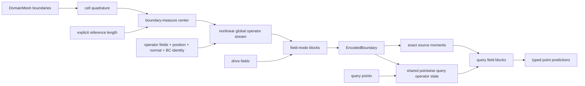

# Mesh Attention: an Exact Global Signed Galerkin Operator

Mesh attention is a global, quadrature-aware, O(\(D\))-equivariant operator for
boundary-driven PDE surrogates. It encodes the boundaries of a
[`DomainMesh`](../../../mesh/domain_mesh.py), propagates physical driving
fields through a separate field stream, and evaluates predictions at arbitrary
query points.

The central layer is a **finite-rank separable signed integral operator**. Its
production path evaluates exact source moments in
\(O(N_{source}+N_{query})\) work per layer for fixed channel and rank sizes. It
does not materialize an all-pairs attention matrix. A dense
`forward_reference` evaluates the identical operator in
\(O(N_{source}N_{query})\) work and exists only as a correctness and gradient
oracle.

There is no softmax, graph neighborhood, distance cutoff, near/far truncation,
or spatial tree in the operator.

## 1. PDE motivation and scope

Many elliptic and approximately elliptic problems are strongly driven by their
boundary data. For Laplace's equation, Green's representation has the form

\[
u(x)=\int_{\partial\Omega}
\left[G(x,y)\,\partial_{n_y}u(y)
-u(y)\,\partial_{n_y}G(x,y)\right]dS_y.
\]

This identity motivates three architectural choices:

1. every boundary source may influence every other source and every query;
2. source contributions are integrated against the boundary measure; and
3. an encoded boundary can be reused at many independent query points.

The implementation is nevertheless a learned general operator, not a literal
boundary-element solver. It does not assume one analytic Green function or
hard-code a distance-decay law. In particular, it does not automatically
enforce harmonicity, a boundary jump relation, conservation, a maximum
principle, or a compatibility condition.

The distinction between geometry and physical driving data is important for
linear PDEs. At fixed geometry and coefficients, a linear boundary-value
problem obeys

\[
\mathcal N_\Gamma(\alpha b_1+\beta b_2)
=\alpha\mathcal N_\Gamma(b_1)+\beta\mathcal N_\Gamma(b_2).
\]

The model provides a `linear` field mode that preserves this law exactly and a
`zero_preserving_nonlinear` mode for problems where content-dependent
nonlinearity is desired.

## 2. `DomainMesh` data contract

The source and query roles are taken from a `DomainMesh`:

- `domain.boundaries` are the source meshes. Each declared boundary must be a
  nonempty codimension-one mesh. Boundary fields are read from `cell_data`.
- `domain.interior.points` are the default query locations. Data already
  attached to the interior are not read as model inputs.
- `domain.global_data` hold declared domain-level fields and, optionally, the
  reference length.

The names in `domain.boundaries` must exactly match the names in
`boundary_field_ranks`. Named boundaries are merged in a deterministic order;
a boundary one-hot feature preserves their BC identity.

### 2.1 Field roles

The implemented schema has two input roles:

- **`operator`** fields describe geometry, material properties, PDE
  coefficients, or other data that may change the learned operator. They may
  affect the result only by conditioning the geometry/operator stream.
- **`drive`** fields are the boundary or global physical data on which the
  solution depends. Setting every declared drive field to zero defines the
  homogeneous zero-input test.

Both roles may contain rank-0 invariant scalars and rank-1 polar vectors.
Boundary role fields are declared separately for each named boundary;
domain-level role fields are declared by `global_field_ranks` and read from
`global_data`. At least one boundary or global drive field is required.
A field path cannot be assigned both `operator` and `drive` roles on the same
boundary, and a global field cannot have both roles. The constructor rejects
either ambiguity rather than allowing one value to enter both streams.

Prediction names and types are declared by `output_field_ranks`. Predictions
are returned in the query mesh's `point_data`. Existing interior target data
cannot leak into a forward pass because the query mesh is stored without its
point or cell data during encoding.

For example, a schema may conceptually distinguish wall roughness as an
operator scalar, prescribed velocity as a drive vector, Reynolds number as a
global operator scalar, and freestream velocity as a global drive vector.

All declared fields are expected to be nondimensional before entering the
model. `reference_length_key` nondimensionalizes coordinates and geometric
measure only; it is not a general units system and does not rescale physical
input or output fields.

Mesh coordinates and declared fields must share a device and use `float32` or
`float64`. Mixed-precision learned layers are supported through autocast, but
geometry, centering, normals, measures, and moment reductions retain at least
FP32 precision; reduced-precision mesh coordinates are rejected.

### 2.2 Minimal API example

Suppose `domain` has `"wall"` and `"farfield"` boundary meshes, the declared
boundary fields in each mesh's `cell_data`, and the declared global fields plus
`reference_length` in `domain.global_data`:

```python
import torch

from physicsnemo.experimental.nn import MeshTransformer
from physicsnemo.mesh import Mesh

model = MeshTransformer(
    n_spatial_dims=3,
    output_field_ranks={"pressure": 0, "velocity": 1},
    boundary_field_ranks={
        "wall": {
            "operator": {"roughness": 0},
            "drive": {"wall_velocity": 1},
        },
        "farfield": {
            "operator": {},
            "drive": {"boundary_velocity": 1},
        },
    },
    global_field_ranks={
        "operator": {"reynolds_number": 0},
        "drive": {"freestream_velocity": 1},
    },
    # domain.global_data["reference_length"] is used only to normalize
    # coordinates and cell measures, so it is absent from both role schemas.
    reference_length_key="reference_length",
    field_mode="linear",
)

# forward predicts at domain.interior.points and returns a Mesh.
prediction: Mesh = model(domain)
pressure = prediction.point_data["pressure"]

# Encode one boundary once, then reuse it at another query mesh.
encoded = model.encode(domain)
query_mesh = Mesh(
    points=torch.randn(
        4096,
        3,
        device=domain.interior.points.device,
        dtype=domain.interior.points.dtype,
    )
)
new_prediction: Mesh = model.decode(encoded, query_mesh)
velocity = new_prediction.point_data["velocity"]
```

Changing `field_mode` to `"zero_preserving_nonlinear"` keeps the same schemas
and API while changing the field-dependence guarantee described in Section 9.

The implementation defaults are deliberately modest capacity settings, not
physical constants:

| Setting | Default |
| --- | ---: |
| Operator scalar / vector channels | 32 / 8 |
| Drive scalar / vector channels | 64 / 16 |
| Operator / boundary-drive blocks | 3 / 2 |
| Query blocks | 1 (`linear`), 2 (nonlinear) |
| Heads | 4 |
| Scalar / vector separable rank | 8 / 4 |
| Query / attention projection chunk | 65,536 / 65,536 |

Changing these values changes finite-rank capacity or execution memory, not
the symmetry group, quadrature semantics, or any physical interaction length.

## 3. Boundary quadrature

For ambient dimension \(D\), each codimension-one boundary contributes cell
quadrature tuples

\[
Q_\Gamma=\{(x_j,w_j,n_j,r_j)\}_{j=1}^{N_s},
\]

where \(x_j\) is the cell centroid, \(w_j\) is its
\((D-1)\)-dimensional measure, \(n_j\) is its cell normal, and \(r_j\) contains
the declared cell fields and boundary identity. The discrete source measure is

\[
\mu_h=\sum_{j=1}^{N_s}w_j\delta_{(x_j,n_j)}.
\]

Every source contraction includes `source_mesh.cell_areas`. Unit weights are
not substituted. Query points are evaluated pointwise and therefore do not
need target quadrature weights.

The current interface is cell-quadrature based. Point-associated boundary
fields, higher-order panel quadrature, and already-integrated face totals must
be converted to the expected cell-value convention before calling the model.
Multiplying an already-integrated face total by cell area again would be a
units error.

If one quadrature sample is replaced by identical samples whose weights sum to
the original weight, the moment operator is algebraically unchanged. This is
not a proof of convergence under an actual remesh: geometric quadrature, field
sampling, and the learned finite-rank kernel must all converge.

## 4. Centering, scale, and similarity covariance

The source origin is the boundary-measure centroid

\[
c=\frac{\sum_j w_jx_j}{\sum_jw_j}.
\]

It is computed from the union of all source boundaries. Query points do not
affect it, and separate boundary patches are not centered independently.

The scale \(L\) is **not** estimated from the geometry:

- if `reference_length_key` is a string, that nested `global_data` leaf must
  be a finite positive scalar and supplies \(L\);
- if `reference_length_key is None`, the model uses \(L=1\) and interprets the
  coordinates as already dimensionless.

There is no fitted RMS radius or other data-dependent length. The normalized
source and query coordinates are

\[
z_j=\frac{x_j-c}{L},\qquad
\zeta_i=\frac{q_i-c}{L}.
\]

The merged source `Mesh` is rebuilt from normalized vertices, so its cell
weights are automatically

\[
\omega_j=\frac{w_j}{L^{D-1}}.
\]

Consider the physical similarity action

\[
x'=sRx+t,\qquad s>0,\qquad R\in O(D).
\]

If the supplied reference length transforms as \(L'=sL\), then

\[
c'=sRc+t,\qquad z_j'=Rz_j,qquad
\zeta_i'=R\zeta_i,qquad \omega_j'=\omega_j.
\]

Thus the model is translation invariant, O(\(D\))-covariant, and
positive-scale covariant under the full declared problem transformation. The
caller must transform every polar-vector field by \(R\), keep dimensionless
scalar parameters consistent, and update the explicit reference length. With
`reference_length_key=None`, no automatic scale covariance is inferred from
newly rescaled coordinates; that option means the caller has already performed
nondimensionalization.

The reference-length leaf is reserved exclusively for geometric
nondimensionalization. The constructor rejects a `reference_length_key` that
is also declared as a global `operator` or `drive` field, because exposing the
dimensional length to a learned path would defeat the similarity contract.

Scaling geometry alone is not necessarily a symmetry of a PDE. For example,
holding dimensional viscosity and velocity fixed while changing length changes
Reynolds number. The architectural statement applies only when the complete
nondimensional physical problem is transformed consistently.

Normals are treated as polar vectors. Under a reflection, a physical outward
normal must transform as \(Rn\). Reflecting triangle vertices while preserving
their ordering can reverse the computed orientation, so reflected meshes must
retain or restore the outward-normal convention.

## 5. Supported geometric types

`ScalarVectorState` contains only:

- invariant scalar channels with shape `(N, C_s)`; and
- polar-vector channels with shape `(N, C_v, D)`.

All vector channel mixing uses the same coefficients for every Cartesian
component. Vector Gram matrices and query/key vector dot products supply
invariant scalars. `GeometryConditionedLinear` additionally permits the two
elementary geometry-mediated type changes:

- a field vector dotted with a geometry vector produces a scalar; and
- a field scalar multiplying a geometry vector produces a polar vector.

It also contains the direct equivariant dyad branch

\[
v_o^{out}\supset
\sum_{f,a,b}C_{ofab}\,(v_f\cdot g_a)g_b,
\]

where \(g_a,g_b\) are geometry-vector channels. This remains linear in the
field at fixed geometry and represents anisotropic maps such as normal
projection \((v\cdot n)n\) and, together with the direct vector path,
tangential projection.

This allows, for example, a scalar drive to produce a vector output using
normalized position or surface normal as a geometric basis.

Pseudoscalars, axial vectors, symmetric tensors, and higher O(\(D\)) irreducible
representations are not supported. They must not be encoded as ordinary scalar
or vector channels. In particular, vorticity-like axial vectors need a future
representation extension.

Here `scalar_rank` and `vector_rank` refer to the finite separable query/key
feature dimensions. They are not physical tensor ranks.

## 6. Exact signed Galerkin attention

For head \(h\), let the projected queries and keys be

\[
q^0_{ihr},\;k^0_{jhr}\in\mathbb R,
\qquad
q^1_{ihrd},\;k^1_{jhrd}\in\mathbb R^D,
\]

with scalar feature rank \(R_0\), vector feature rank \(R_1\), and Cartesian
index \(d\). The invariant signed coefficient is

\[
a_{ijh}
=\frac{1}{\sqrt{R_0+DR_1}}
\left(
\sum_{r=1}^{R_0}q^0_{ihr}k^0_{jhr}
+\sum_{r=1}^{R_1}\sum_{d=1}^{D}
q^1_{ihrd}k^1_{jhrd}
\right).
\]

The scale is applied to the projected queries in code. The coefficient is a
joint O(\(D\)) invariant: geometry and every polar-vector input transform
together. It is unconstrained and signed. There is no exponential, softmax,
absolute value, distance envelope, or positivity constraint.

Let \(v^0_{jhf}\) and \(v^1_{jhfe}\) be projected scalar and polar-vector values.
Before the final typed output projection, dense attention would compute

\[
o^0_{ihf}=\sum_j\omega_j a_{ijh}v^0_{jhf},
\qquad
o^1_{ihfe}=\sum_j\omega_j a_{ijh}v^1_{jhfe}.
\]

This is the exact signed Galerkin/linear-attention formula implemented by
`MeshAttention`. "Galerkin" refers to the quadrature-weighted query/key/value
pairing; because predictions are collocated at query points, the evaluation is
also naturally viewed as a Nyström discretization rather than a finite-element
Galerkin method with explicit trial and test bases.

### 6.1 Exact source moments

Separability permits the source sum to be reassociated. The implementation
builds four typed moments:

\[
M^{00}_{hrf}=\sum_j\omega_jk^0_{jhr}v^0_{jhf},
\]

\[
M^{10}_{hrdf}=\sum_j\omega_jk^1_{jhrd}v^0_{jhf},
\]

\[
M^{01}_{hrfe}=\sum_j\omega_jk^0_{jhr}v^1_{jhfe},
\]

\[
M^{11}_{hrdfe}=\sum_j\omega_jk^1_{jhrd}v^1_{jhfe}.
\]

Each receiver then contracts its query with these moments:

\[
o^0_{ihf}
=\sum_rq^0_{ihr}M^{00}_{hrf}
+\sum_{r,d}q^1_{ihrd}M^{10}_{hrdf},
\]

\[
o^1_{ihfe}
=\sum_rq^0_{ihr}M^{01}_{hrfe}
+\sum_{r,d}q^1_{ihrd}M^{11}_{hrdfe}.
\]

These are algebraic rearrangements of the dense formula, not a numerical
approximation. Every source contributes to every moment, and every receiver
reads those global moments. The layer therefore has global all-to-all semantics
despite never constructing an \(N_q\times N_s\) matrix.

The four reductions use the mesh-native `integrate_moment(mesh, left, right)`
functional from `physicsnemo.mesh.calculus`.
Attention heads are declared as aligned moment groups, so head \(h\) contracts
only with head \(h\) while the `Mesh` owns geometric measure, NaN policy, and
accumulation precision.

Moment accumulation is promoted to at least fp32 by default and never
downcasts fp64 inputs. Results are cast back to the working dtype before the
typed output projection.

### 6.2 Dense oracle

`MeshAttention.forward_reference` explicitly forms the signed pair scores and
evaluates the same quadrature sum in \(O(N_sN_q)\) work. It is intended for:

- fast-path versus dense value tests;
- fast-path versus dense parameter and input-gradient tests; and
- diagnosing a change to the moment contractions.

It is not the production execution path or a more expressive model.

## 7. Finite-rank separability: benefit and tradeoff

Per head, the effective score matrix has rank at most

\[
R_0+DR_1.
\]

This is the mathematical definition of the layer and the source of its exact
linear complexity. It is not a low-rank approximation chosen at inference
time.

The benefits are:

- exact global communication at linear cost in source and query count;
- no graph, cutoff, or tree-dependent change of semantics;
- reusable source moments for independent query chunks; and
- exact agreement with a simple dense oracle.

The corresponding capacity limitation is real. At fixed ranks, one layer
cannot represent an arbitrary full-rank pair kernel, pair-specific radial
function, sharp local selector, or singular Green kernel. Coordinate dependence
enters through learned per-token query and key embeddings, not through an
arbitrary nonlinear function evaluated jointly on each pair.

The nonlinear global operator stream makes each source embedding depend on the
whole boundary before it is used by later field and query layers. Increasing
`scalar_rank`, `vector_rank`, heads, channel multiplicities, or depth increases
capacity while retaining linear complexity in \(N\), but none of these choices
turns the model into an exact boundary-integral solver.

Heads and separable ranks are capacity parameters, not physical length scales
or additional invariance assumptions.

## 8. Two-stream model

The model deliberately separates a nonlinear operator stream from the physical
drive stream:



### 8.1 Operator stream

The source operator state is lifted from:

- declared boundary and global `operator` fields;
- normalized cell centroid;
- cell normal;
- boundary-name one-hot values; and
- a source/query association indicator.

Immediately after `operator_lift`, source and query tokens pass through the
same `PointwiseGeometryBlock`. This is a nonlinear typed residual feature map
with no interaction, neighborhood, or cutoff. Sharing it enriches the
finite-rank coordinate basis consistently on both sides of attention before
the source operator state enters its global blocks.

`MeshOperatorBlock` applies nonlinear typed RMS normalization, exact global
moment attention, an equivariant pointwise feed-forward network, residual
connections, and learned per-channel layer scales. Biases and nonlinearities
are allowed here because this stream describes the operator rather than the
physical solution amplitude.

Normalized coordinates are carried as polar-vector channels. Raw Cartesian
components are not passed independently through a scalar MLP. There are no
Fourier coordinate features, graph eigenvectors, PCA frames, vertex-index
embeddings, pair distances, or radial cutoffs.

### 8.2 Drive lift and boundary propagation

Declared boundary and global `drive` fields are packed separately. A
`GeometryConditionedLinear` lift maps them into the drive latent using the
operator state. This map may convert scalar and vector types through geometry,
but it remains exactly linear in the drive argument at fixed operator state.

The selected field block then performs global boundary-to-boundary propagation.
The implementation uses different block classes for the two field modes so a
normalization, bias, or activation added to nonlinear mode cannot silently
invalidate the linear-mode proof.

### 8.3 Reusable boundary encoding and queries

`MeshTransformer.encode` returns an `EncodedBoundary` containing the
dimensionless source mesh, operator and drive states, center, reference length,
global operator and drive states, the source moments for every query block, and
the default query mesh. It contains no neighborhood, tree, or query-dependent
interaction plan.

`MeshTransformer.decode` may evaluate the default interior points or another
query `Mesh` with the same spatial dimension, device, and dtype. Query operator
tokens contain normalized query position, global operator data, and a query
association indicator. Boundary-only fields, BC one-hot values, and query
normal are zero at ordinary query points. A declared global drive, such as a
prescribed far field, is also lifted directly at each query; this gives it a
pointwise path in addition to its geometry-dependent boundary-integral path.
That path remains linear in `linear` mode and zero-preserving in both modes.

Each query field block constructs its source moments during `encode`. They are
reused over all `query_chunk_size` chunks and subsequent `decode` calls. Query
points do not interact with one another, so changing query chunking or query
order does not change the mathematical operator beyond floating-point ordering
effects. The output projection is geometry-conditioned and typed; predictions
are written to query `point_data`. An encoding is tied to the model parameters
that produced it and must be rebuilt after an optimizer update.

Within every attention block, `attention_chunk_size` also bounds the number of
entities passed through a typed query/key/value projection at once. Source
chunks are integrated immediately into the four small moment tensors rather
than retained and concatenated. Under `torch.no_grad()`, this bounds live
Gram/projection workspace. With autograd enabled, PyTorch retains each chunk's
saved activations for backward, so total training activation memory remains
linear in entity count; chunking does not by itself bound that saved memory.
This does not change the mathematical kernel, and changing chunk size may
change only ordinary floating-point summation order.

## 9. Field modes

The canonical modes are `linear` and `zero_preserving_nonlinear`.

### 9.1 `linear`

`LinearMeshFieldBlock` obtains queries and keys only from the operator state.
Values come from the drive state through bias-free projections with vector Gram
invariants disabled. Its pointwise map and final output map are
geometry-conditioned but linear and bias-free in the field.

For fixed geometry and fixed operator-role data, the entire drive-to-output map
therefore satisfies, up to floating-point arithmetic,

\[
\mathcal N_\Gamma(0)=0,
\qquad
\mathcal N_\Gamma(\alpha b_1+\beta b_2)
=\alpha\mathcal N_\Gamma(b_1)+\beta\mathcal N_\Gamma(b_2).
\]

The operator stream may remain nonlinear in geometry and material parameters;
that does not violate field superposition at fixed operator state.

The linear field path contains no field-amplitude normalization, activation,
content-dependent score, or additive field bias. Query/key scalar biases are
permitted because those projections read only the operator state.

### 9.2 `zero_preserving_nonlinear`

`NonlinearZeroMeshFieldBlock` concatenates operator and field states when
forming queries and keys. Its value projection may include invariant vector
Gram features, and its pointwise feed-forward update uses content-dependent
gates. These operations make the field map nonlinear while retaining the same
separable moment structure and linear complexity in entity count.

Bias-free field values and structurally multiplicative updates ensure

\[
\mathcal N_\Gamma(0)=0.
\]

This mode does not guarantee homogeneity or superposition. It is appropriate
only when that loss of linear-PDE structure is intentional.

If a nonzero far field or forcing should generate a solution when local
boundary values are zero, it must be declared as a global or boundary `drive`
field. The zero-input statement zeros all drive-role fields; it does not erase
geometry or operator-role conditioning.

### 9.3 Shared implementation and guarantees

Both modes share:

- boundary cell quadrature;
- boundary-measure centering and explicit coordinate scaling;
- the nonlinear operator stream;
- scalar/polar-vector typed projections;
- exact signed source moments;
- query chunking and decoding; and
- the bias-free geometry-conditioned output projection.

They differ only in field-dependent hooks:

| Property | `linear` | `zero_preserving_nonlinear` |
| --- | --- | --- |
| Query/key may read the field | No | Yes |
| Value dependence on field | Linear | Nonlinear, zero at zero |
| Pointwise field update | Linear, bias-free | Nonlinear, zero-preserving |
| Exact zero-input behavior | Yes | Yes |
| Exact fixed-operator superposition | Yes | No |

## 10. Why there are no neighborhoods or trees

Mesh connectivity is used to compute cell centroids, measures, and normals. It
does not define learned one-ring messages. The model has no kNN graph, radius
graph, local-content mask, compact support, or near/far split.

Local graph semantics are undesirable for this boundary operator because:

- a one-ring physical radius shrinks under refinement;
- kNN and radius graphs change discontinuously as geometry moves;
- a fixed number of graph layers has no resolution-independent receptive
  field; and
- a local/far rule can suppress the distant boundary data that elliptic
  problems require.

A tree is also unnecessary for the implemented kernel. Exact finite-rank
separability already reduces the global sum to source moments in linear time.
The moment path retains every source contribution and is exactly equivalent to
the dense all-pairs formula.

## 11. Complexity and memory

Let

- \(H\) be the number of heads;
- \(R_0,R_1\) the scalar and vector query/key ranks;
- \(F_0,F_1\) the scalar and vector value dimensions; and
- \(D\) the spatial dimension.

The four moment families have a fixed feature cost proportional to

\[
C_{moment}
=H\left(R_0F_0+R_1DF_0+R_0F_1D+R_1F_1D^2\right).
\]

With these architecture sizes fixed, one cross layer costs

\[
O(N_s C_{moment}+N_q C_{moment})
=O(N_s+N_q)
\]

in entity count, plus linear-cost projections and pointwise maps. A self layer
has \(N_q=N_s\) and remains \(O(N_s)\).

For \(L_o\) operator blocks, \(L_d\) boundary drive blocks, and \(L_q\) query
blocks, the model's entity-count scaling is

\[
O\left((L_o+L_d)N_s+L_q(N_s+N_q)\right),
\]

with feature-dependent constants omitted.

The moment tensors are independent of \(N_s,N_q\). Runtime memory never stores
the quadratic source-query matrix. With autograd enabled, saved activations are
linear in total source and query count; under `torch.no_grad()`, live projection
workspace is bounded by the configured chunks. Larger ranks and vector value
sizes increase the constant substantially, especially the \(R_1F_1D^2\)
vector-key/vector-value moment.

`query_chunk_size` is an execution setting, not a model-semantic cutoff. Source
moments are reused across chunks and across different query meshes evaluated
from the same `EncodedBoundary`.

`attention_chunk_size` is likewise an exact live-workspace setting, not a
semantic cutoff. It is especially relevant to no-grad evaluation in
`zero_preserving_nonlinear` mode, where invariant Gram features of the combined
operator/field vectors would otherwise create a large temporary tensor over
the complete source mesh. Training-time activation checkpointing or custom
recomputation is a possible future optimization, not part of this interface.

## 12. Dense oracle and future acceleration policy

The source-moment path is not an approximation backend. It is the exact
implementation of the model's separable kernel. Changing chunk size does not
change its rank or interaction semantics.

`forward_reference` is the required dense oracle and should remain simple. Any
future change to query/key contractions or typed moments must compare both
values and gradients against it.

A future **nonseparable** pair kernel would be a different mathematical layer;
the present four moments could not evaluate it exactly. If such a layer later
uses low-rank, hierarchical, or multipole acceleration, it must provide:

1. a dense oracle for the same nonseparable formula;
2. no silently dropped field/content term;
3. a convergence or error-control test; and
4. an explicit statement when rotations or other invariances become only
   approximate.

An axis-aligned spatial tree is not part of the current model or its cache
contract.

## 13. Guaranteed properties and capacity choices

Subject to correctly typed inputs and consistent normal orientation, the model
is designed to guarantee:

- permutation/reindexing equivariance of source and query order;
- global all-to-all source semantics;
- translation invariance from boundary-measure centering;
- O(\(D\)) covariance for invariant scalars and polar vectors;
- positive-scale covariance when the explicit reference length and complete
  nondimensional problem transform consistently;
- quadrature-weighted source aggregation;
- exact equality of fast moments and the dense formula, up to floating-point
  contraction order;
- exact zero-drive output in both field modes; and
- exact fixed-operator superposition in `linear` mode.

The following are capacity choices, not stronger physical guarantees:

- scalar and vector latent channel counts;
- head count;
- `scalar_rank` and `vector_rank`;
- numbers of operator, drive, and query blocks;
- nonlinear operator feed-forward width;
- field mode; and
- query chunk size, which changes memory use only.

The architecture does not by itself guarantee:

- satisfaction of a PDE residual or boundary condition;
- conservation, reciprocity, coercivity, positivity, or a maximum principle;
- Neumann compatibility or gauge fixing;
- an analytic Green-function singularity, jump relation, or far-field decay;
- convergence under arbitrary remeshing;
- accuracy on unseen geometry families; or
- stability at arbitrary depth or separable rank.

Those properties require an analytic kernel, constrained operator, compatible
discretization, loss, or solver designed for the particular PDE.

## 14. Validation contract

Tests should distinguish exact algebraic properties from empirical convergence:

- compare moment evaluation and `forward_reference` values and gradients;
- permute boundary cells, named-boundary ordering, and query points;
- translate, rotate, and reflect coordinates, normals, all polar-vector fields,
  and vector outputs together;
- uniformly scale geometry and the explicit reference length together, checking
  the normalized cell measures;
- verify that `reference_length_key=None` performs no data-dependent scale fit;
- split identical quadrature samples with conserved measure and separately test
  convergence under genuine surface refinement;
- verify that data attached only to `domain.interior` cannot affect output;
- verify zero output with all drive-role fields zero;
- verify superposition in `linear` mode and deliberately avoid claiming it in
  `zero_preserving_nonlinear` mode;
- compare query results across chunk sizes and across reused boundary encodings;
  and
- reject rank specifications other than invariant scalar or polar vector.

The dense oracle tests separable algebra. It does not validate PDE fidelity or
OOD-geometry accuracy.

## 15. Limitations

The current model is intentionally narrow:

- sources are codimension-one boundary cells with cell-centered fields;
- the caller is responsible for a valid, consistently oriented boundary union;
  `forward` does not perform an expensive watertightness check;
- queries are mesh points and do not interact with one another;
- only invariant scalars and polar vectors are represented;
- all physical fields must be nondimensionalized by the caller;
- body/volume forcing has no separate source mesh;
- analytic singular and nearly singular boundary quadrature is not provided;
- interior connectivity is preserved in the returned mesh but is not used by
  the pointwise decoder; and
- finite-rank separability may be a bottleneck for sharp, highly local, or
  singular operators.

These limitations make the reference semantics precise: a global signed
operator with exact quadrature moments, exact linear entity-count scaling, and
clear linear versus zero-preserving nonlinear field guarantees. More specialized
physics and broader geometric types can be added without redefining that core.
