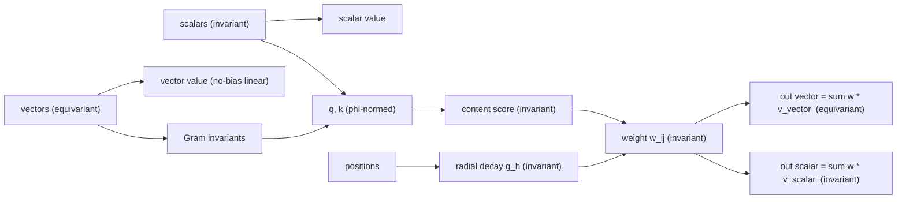
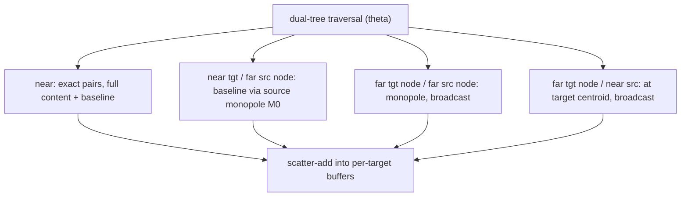

# Mesh Attention and the Mesh Transformer

A design summary of `MeshAttention`, `RadialDecay`, and `MeshTransformerBlock`
(in [attention.py](attention.py) and [block.py](block.py)),
covering **how it works**, the **motivation**, and the **major engineering and
theoretical tradeoffs** made in the design.

> Status: `MeshAttention` (the layer), `RadialDecay` (its envelope), and
> `MeshTransformerBlock` (a pre-norm transformer block) exist and are tested.
> A full end-to-end *Mesh Transformer model* (encoder stack + decode to query
> points) is the intended next step and does not yet exist as a single class;
> where this document says "mesh transformer" it refers to the block plus the
> roadmap for that model.

---

## 1. Motivation

### 1.1 The problem

We want ML surrogates for PDE-governed systems (the immediate target being
external aerodynamics: surface pressure, wall shear stress, volume fields), and
we want them to be **foundation-model-grade**: accurate, performant on large
meshes, and able to generalize across geometries, boundary conditions, scales,
and discretizations. PDE training data is scarce and expensive (each sample is a
CFD/FEM solve), which inverts the usual "bitter lesson" calculus: we cannot rely
on scale alone to wash out poor inductive biases, so **inductive biases that
encode the exact symmetries of the physics are data-efficiency multipliers** and
are worth building in - *but only where they are genuinely exact*.

### 1.2 The two families this unifies

Two lines of work each had half of what we want:

- **GLOBE** ([physicsnemo/experimental/models/globe](../../models/globe)) is a
  learnable Green's-function / boundary-integral operator. It is **mesh-native**
  (operates on `Mesh` objects with rank-typed semantic fields), **exactly
  equivariant** (translation / rotation / parity, jointly over geometry and
  boundary-condition vectors), **discretization- and units-invariant**, and it
  scales to large meshes via a dual-tree Barnes-Hut acceleration. But its
  "tokens" only carry a *positional* query - there is no learned, content-based
  routing.
- **Transolver / GeoTransolver / FLARE** are transformer attention models. They
  have flexible, content-based, scalable attention, but operate on flat
  `(B, N, C)` tensors with no equivariance and no mesh structure.

### 1.3 The key insight

Attention `softmax(QKᵀ)V` is O(N²). But for a physical operator the interaction
between two tokens should **decay with distance** - so the attention matrix is
*hierarchically low-rank off-diagonal*, exactly the structure that the Fast
Multipole Method exploits. If you build a distance-decaying attention score you
would "absolutely build a dual-tree traversal to approximate it." This is
precisely GLOBE's machinery: **GLOBE's `BarnesHutKernel` is already ~90% of a
mesh-attention engine.** The missing 10% is a *learned content term* in the
score (GLOBE's target side is content-free).

`MeshAttention` is the result: **attention whose tokens are mesh cells, whose
weights are a content score times a learnable physical distance-decay, evaluated
in near-linear time on GLOBE's dual tree, and equivariant by construction.** It
is the FMM-attention family (FMMformer, H-Transformer, Fast Multipole Attention)
generalized for the first time to 3D unstructured meshes with a physically
grounded, equivariant score.

---

## 2. How it works

### 2.1 Tokens and the rank-typed state

Tokens are mesh cells (or arbitrary points). Each token carries:

- a **position** `x_i` (cell centroid),
- a **quadrature weight** `alpha_i` (cell area), and
- a **rank-typed feature state**: `scalars` (rotation-invariant, `(N, C_s)`) and
  optional `vectors` (rotation-equivariant, `(N, V, D)`).

The scalar/vector split is inherited from GLOBE's `physical`/`latent` namespaces
and from the geometric-vector-perceptron (GVP) / Vector-Neurons line: it is the
"type system" that makes per-field equivariance tractable.

### 2.2 The operator

For attention heads `h = 1..H` with head dimension `d`, the layer computes an
**unnormalized integral operator**:

```text
o_{i,h} = sum_j  w^h_{ij} * v_{j,h}

w^h_{ij} = ( a_h * <phi(q^h_i), phi(k^h_j)>  +  b_h ) * g_h(||x_i - x_j||) * alpha_j
```

- `q, k` are projected from the (invariant) scalar features, so the content
  score `<phi(q), phi(k)>` is invariant. `phi` is a per-token normalization set
  by `qk_norm` (see Tradeoff T3).
- `g_h` is a learnable **radial decay envelope** (`RadialDecay`):
  `g_h(r) = (1 + (r/ell_h)^2)^(-p)`, with `g_h(0)=1` (strong local attention) and
  algebraic far-field decay. Each head has its **own** length scale `ell_h`
  ("heads as scales" - see T6).
- `a_h` (content gain) and `b_h` (baseline gain) are learnable per head. The
  `b_h` term is a content-free geometric smoother; the `a_h` term is the
  content-selective attention.
- `alpha_j` is the area / quadrature weight; it is what makes this a
  *discretization-invariant integral*, not a sum that grows with mesh density.
- `v_{j,h}` is a packed value with a **scalar part** (a linear projection of the
  scalar features, dimension `d`) and an **equivariant vector part** (a bias-free
  linear combination of the token's input vectors, dimension `D`).

Because every `w^h_{ij}` is an invariant scalar, the scalar output is invariant
and the vector output (an invariant-weighted sum of equivariant vectors) is
equivariant.

### 2.3 Equivariance, concretely



Vectors influence the scalar/attention path **without breaking equivariance** by
contributing their rotation-invariant Gram dot-products (`<v_c, v_c'>`) as extra
scalar features (`vector_invariants=True`). This is GVP's trick (extract vector
norms as invariant scalars), generalized to the full Gram upper triangle.

### 2.4 Near-linear evaluation: the dual tree

Materializing the `(N_t, N_s, H)` weight matrix is O(N²). Instead, because the
score decays with distance, the layer reuses GLOBE's
[`ClusterTree`](../../../mesh/spatial/cluster_tree.py) dual-tree Barnes-Hut
traversal (promoted into `physicsnemo.mesh.spatial`). The traversal classifies
every source-target interaction into four categories, and the operator is
split into two pieces so that the code is clean *and* the `theta=0` limit is
exactly the dense operator:

- a **content-free baseline** `B_i = sum_j g_h(r_ij) * alpha_j * v_j`, evaluated
  over *all* sources via the four dual-tree phases (near exact; far via
  area-weighted cluster monopoles `M0`), and
- a **near-only content correction**
  `C_i = sum_{j near i} <phi(q_i),phi(k_j)> g_h(r_ij) alpha_j v_j`.

The output is `a_h * C + b_h * B` (optionally divided by the envelope mass).



- **Cost**: an `O(N log N)` tree build plus `O(N)` far-field node interactions;
  near pairs are exact.
- **Monopole `M0`**: a far source cluster contributes its area-weighted *sum* of
  values at its centroid (recovered as `node_mean * node_total_area`).
- **`theta=0`** makes every interaction near/exact, so the hierarchical forward
  reproduces `forward_reference` (the brute-force O(N²) dense path) to machine
  precision. This is the correctness oracle.

### 2.5 The block and the (future) model

`MeshTransformerBlock` is a standard pre-norm transformer block over the
**scalar** stream, with the equivariant vector stream carried through the
attention residual:

```text
s <- s + MeshAttn(LN(s), v)_scalar
v <- v + MeshAttn(LN(s), v)_vector
s <- s + MLP(LN(s))
```

The MLP and LayerNorms touch only the invariant scalar stream, so the whole
block is `O(D)`-equivariant. The tree and plan depend only on geometry, so they
are built once and shared across a stack of blocks.

The intended full **Mesh Transformer model** stacks these blocks as an encoder
over boundary tokens and then uses `MeshAttention` in **cross-attention** mode
(`query_*` arguments / a distinct `target_tree`) to decode fields at arbitrary
query points - the GLOBE-style boundary -> volume evaluation. The layer already
supports this; the orchestrating model class is future work.

---

## 3. Major tradeoffs

### Theoretical

**T1 - Unnormalized (no softmax).** The operator is `sum_j w_ij v_j` with no
softmax partition function. This is the physically correct object for
PDE-operator learning: a Green's-function/boundary integral `u(x) = integral
G(x,y) f(y) dy` is *not* normalized, and the Galerkin Transformer (Cao,
NeurIPS 2021) proves softmax is "sufficient but not necessary" - softmax-free
attention is provably comparable to a Petrov-Galerkin projection and empirically
*better* on PDE benchmarks. Softmax was deliberately rejected: it is a different
axis (a cross-key normalization of `exp`-scores, not a per-token transform), it
**breaks the exact far-field factorization** (forcing Performer/KDE-style
approximations, as in FMMformer/KDEformer), and it needs a second hierarchical
reduction (the partition function). The price of going unnormalized is the known
expressivity gap of linear/bilinear attention (non-injectivity, weak locality);
but our **distance-decay envelope and exact near field directly supply the
locality** that the linear-attention literature (cosFormer, "Bridging the
Divide") identifies as the missing ingredient, so the gap is largely closed in
this setting.

**T2 - The far field is a truncation, not a controlled approximation (the
central honest tradeoff).** With `far_field="m0"`, far interactions keep only the
content-free baseline; the content term is dropped at range. Crucially, `theta`
bounds the *geometric* (monopole) error of the envelope, but it does **not**
bound the dropped content term, whose relative size is
`a_h * <phi(q),phi(k)> / b_h` - independent of `theta` and free to grow during
training. Consequences, all documented in the class docstring:

- At `theta > 0` the layer computes a *different operator* than the dense
  reference ("near-field content attention plus global learned smoothing"), so
  `theta` is **part of the model definition** - a checkpoint trained at one
  `theta` and evaluated at another is a different model.
- A `content_to_baseline_ratio` property (`|a_h / b_h|`) is exposed to monitor
  how much of the operator the truncation discards.
- The principled fix (a content-carrying far field, `far_field="m0+m1"`, which
  would add a per-cluster content moment) is reserved but **not yet
  implemented**, because of its `d x F_v` per-node memory cost.

This was chosen over the alternatives (content-blind everywhere, or a full M1
far field) as the right v1 inductive bias: *fine content selection is local;
at range you receive a region's bulk signal.*

**T3 - Q/K normalization (`qk_norm`), and a corrected justification.** The score
uses a per-token transform `phi(q), phi(k)`: `layernorm` (default), `cosine`
(Swin V2, hard-bounded to `[-1,1]`), or `none` (raw). LayerNorm is the default
because the closest precedent - the Galerkin Transformer for *softmax-free PDE
attention* - uses Q/K LayerNorm to let a learnable scale propagate across layers,
which cosine's hard bound would destroy. An earlier design rationale claimed
cosine was needed to make the far field factorize; that was **wrong** and has
been corrected: factorization follows from a bilinear-in-transformed-features
score plus query-independent values, and holds for *any* per-token `phi`. So
`qk_norm` is purely a stability/expressivity knob, kept configurable.

**T4 - Equivariance scope.** Equivariance is **exact on the dense path**
(`forward_reference`, or `theta=0`) - verified to ~1e-15 for translation,
rotation, and reflection. At `theta > 0` the Morton-code tree build (and hence
the near/far partition) is orientation- and translation-dependent, so the output
changes slightly under rigid motions: **equivariance holds only up to the
hierarchical approximation error**. This is an honest, documented limitation
shared with all Barnes-Hut/FMM methods. The equivariance is *joint* over
geometry and input vectors (rotate positions and vectors together), which is
what lets an exactly-equivariant model still represent anisotropic physics
(freestream direction, gravity) by treating those as co-transforming input
vectors.

**T5 - The equivariant path is intentionally minimal.** The vector value is a
*linear*, bias-free combination of input vectors (no GVP-style vector gating or
nonlinearity), the vector invariants are the *raw* Gram (not L2-norm or
`smooth_log`), and the block has **no scale control on the equivariant path** -
the vector stream gets residual updates from an unnormalized operator with no
norm of its own. In deep stacks vector magnitudes (and the Gram features) can
drift; the block docstring flags this and suggests a PaiNN-style equivariant
vector norm (rescale each channel by the RMS of its norms) if it becomes a
problem. These were left as minimal-but-correct v1 choices rather than
unvalidated architecture additions.

**T6 - Heads as scales.** Each head has its own learnable decay length scale,
initialized across a geometric range. This replaces GLOBE's explicit multiscale
kernel *branches* with a single mechanism: different heads specialize to
different spatial scales (boundary layer vs. wake) for free.

### Engineering

**E1 - Reuse GLOBE's dual tree, and the content/baseline decomposition.** Rather
than reimplement spatial acceleration, `ClusterTree` / `DualInteractionPlan` /
`SourceAggregates` were *promoted* out of GLOBE into
[physicsnemo.mesh.spatial](../../../mesh/spatial/cluster_tree.py) so both GLOBE and
this layer depend on a shared, battle-tested structure (avoiding a backwards
`nn -> models` dependency). Splitting the operator into a content-free baseline
(all four phases) plus a near-only content correction keeps the four-phase
plumbing identical to GLOBE's and makes the `theta=0` oracle exact.

**E2 - Trees built `no_grad` + `@torch.compiler.disable`.** Tree construction and
the dual traversal are combinatorial (Morton codes, AABB propagation,
data-dependent control flow): they carry no useful gradient and are not
traceable by `torch.compile`. They are built in a `no_grad`, compile-disabled
helper (mirroring GLOBE). Geometry gradients still flow through the
differentiable `r_sq` and aggregate computations done outside that helper. The
practical implication: **to use `torch.compile`, precompute trees/plan and pass
them in**; full end-to-end compilation of the layer is untested.

**E3 - Accumulation dtype and determinism.** The hierarchical scatter
accumulates in a dtype at least as wide as fp32 (the decay runs in >= fp32 via
its fp32 length-scale parameter), avoiding `index_add_` dtype mismatches under
bf16/fp16 and improving sum precision; the result is then cast back to the
working dtype so downstream projections behave. Note that `index_add_` is
**non-deterministic on CUDA** (atomic adds); set
`torch.use_deterministic_algorithms(True)` for reproducible (slower) runs.

**E4 - The `areas` footgun and the prebuilt-tree contract.** `areas` defaults to
ones for convenience, but on a non-uniform mesh that **breaks
discretization-invariance** and (in the pure-unnormalized default) makes output
magnitude scale with local point density - so callers should pass true cell
areas. Relatedly, the far field recovers the area-weighted sum using the tree's
*build-time* total area, so a precomputed `source_tree` must be built with the
same `areas`; this contract is now **enforced** by `_check_tree_areas` (a cheap
root-total-area check), not merely documented.

**E5 - No chunking/checkpointing yet (the scale ceiling).** The near phase
materializes the per-pair `q`/`k`/`value` gathers at once (peak memory
`O(n_near * H * (d + F_v))`). `n_near` grows as `theta` and `leaf_size` shrink
and with point density. A `leaf_size` knob trades plan size against near-pair
count, but at the ~1M-token scale this term dominates and GLOBE-style
gather-inside-checkpoint + auto-chunking is the main deferred performance work.

**E6 - API and amortization.** The forward is rank-typed and self/cross-attention
aware: `forward(scalars, positions, vectors=None, areas=None, *, query_*, trees,
plan, theta, source_aggregates)`. `compute_source_aggregates` lets callers
amortize the per-node aggregation across several forwards within one step (e.g.
many query sets attending to one source set), with validation that a supplied
aggregate matches the layer/tree. Input validation is thorough but skipped under
`torch.compile`.

**E7 - Placement.** `MeshAttention` / `MeshTransformerBlock` subclass
`nn.Module` (not `physicsnemo.Module`), consistent with the existing attention
*layer* precedent (`FLARE`, `PhysicsAttention`); the eventual full model would be
a `physicsnemo.Module`. They live under `physicsnemo.experimental.nn` since the
APIs are still evolving.

---

## 4. Correctness and validation

The test suite ([test/experimental/nn/test_mesh_attention.py](../../../../test/experimental/nn/test_mesh_attention.py))
covers:

- **Convergence oracle**: hierarchical `theta=0` equals the dense reference to
  ~1e-8 across all `qk_norm` / `mass_normalize` / `vector_invariants` settings.
- **Far-field exactness**: with a constant envelope (huge length scale =>
  `g == 1`) and `content_gain=0`, the cluster monopole is exact, so the
  hierarchical forward must equal the dense reference at `theta > 0`. This is the
  only test that routes through - and so validates - the `(near,far)`,
  `(far,near)`, and `(far,far)` broadcast phases and the source-coverage /
  no-double-count property (which `theta=0` never exercises).
- **Equivariance**: translation, rotation, and reflection on the dense path
  (scalars invariant, vectors equivariant) to ~1e-15.
- **Discretization-invariance**: splitting sources into equal-area copies leaves
  the (cross-attention) output unchanged.
- **Gradients**: parameter gradients of the tree forward match the dense
  reference at `theta=0`; gradients flow finitely under AMP.

---

## 5. Lineage and prior art

- **GLOBE** - the boundary-integral, equivariant, dual-tree operator this is
  built on; supplies the `ClusterTree`, the equivariant feature recipe, and the
  rank-typed-field philosophy.
- **FMMformer / H-Transformer-1D / Fast Multipole Attention** - the
  near-field-exact / far-field-low-rank decomposition (FMMformer even *beats*
  dense attention on Long Range Arena); here generalized to 3D meshes with a
  physical, equivariant score.
- **Galerkin Transformer (Cao, 2021)** - the justification for softmax-free
  attention and Q/K LayerNorm in PDE-operator learning.
- **Swin Transformer V2** - the scaled-cosine option for bounded scores.
- **Geometric Vector Perceptrons / Vector Neurons / PaiNN** - rank-typed
  scalar+vector features, invariant-from-vector extraction, and equivariant
  vector normalization.
- **Transolver / GeoTransolver / FLARE** - the physics-attention family this
  complements; `FLARE` lives in the same package as a different (global-query
  routing) linear-cost attention.

---

## 6. Roadmap

Deferred, in rough priority order:

1. The full **Mesh Transformer model** (encoder stack + cross-attention decode at
   query points, GLOBE-style multi-BC handling and `global_data` conditioning).
2. **Gradient checkpointing + chunking** for the near phase (the main scale
   ceiling).
3. The **`m0+m1` content-carrying far field** (smooths the content truncation of
   T2; pays a `d x F_v` per-node memory cost).
4. **Equivariant vector normalization / gating** for deep-stack stability and
   vector expressivity (T5).
5. Verified **`torch.compile`** support end to end.
